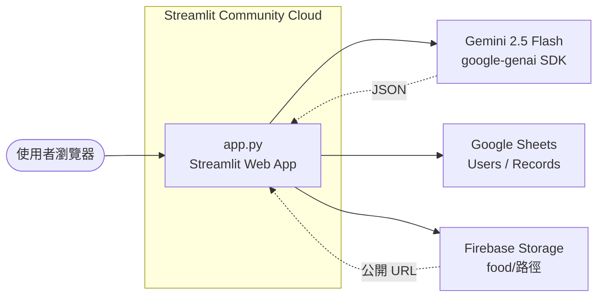

# 熱量與飲水紀錄 Web App

> AI 智能多人熱量與飲水紀錄 — Streamlit + Gemini 2.5 Flash + Google Sheets + Firebase Storage

**線上版本**：[https://worldgymzoe-caloriesoe.streamlit.app/](https://worldgymzoe-caloriesoe.streamlit.app/)
**Repository**：[hungwei62-blip/calorie-tracker](https://github.com/hungwei62-blip/calorie-tracker)
**狀態**：Phase 1 (MVP) 上線，Phase 2 規劃中

## 概述

這是一個「多人使用」的熱量與飲水紀錄網頁應用程式。透過 Gemini 2.5 Flash 的多模態辨識，使用者可以：

- 📷 拍照上傳食物照片
- 🖼️ 從手機圖庫上傳照片
- ✍️ 純文字描述（一盤肉絲炒飯跟一顆滷蛋）
- 💧 快速記錄飲水量（ml）

後端用 Google Sheets 當資料庫、用 Firebase Storage 存照片、用 bcrypt 雜湊密碼，整個 App 部署在 **Streamlit Community Cloud**（免費）。

---

## 架構

### 系統圖



### 檔案分層

```
calorie-tracker/
  app.py                       # Streamlit 入口，~505 行
  gemini_nutrition.py          # CLI 版（單機測試用）
  requirements.txt             # Python 套件清單
  .gitignore
  .devcontainer/               # VS Code Dev Container 設定
  .streamlit/                  # 本機 secrets（不入 git）
  config/
    secrets.example.toml       # Secrets 範例
  docs/
    SETUP_GCP_FIREBASE.md      # GCP / Firebase 建置教學
    DEPLOY_CHECKLIST.md        # Streamlit Cloud 部署檢查表
  services/
    __init__.py
    auth.py                    # bcrypt 雜湊、使用者查詢
    firebase.py                # Firebase Storage 上傳
    gemini.py                  # Gemini 2.5 Flash 4 欄營養解析
    metrics.py                 # 進度計算、達成率
    sheets.py                  # gspread 封裝 (CRUD + 快取)
  tools/
    json_to_toml.py            # Service Account JSON → TOML
  _backup/                     # 本機備份（不入 git）
```

### 各檔案職責

| 檔案 | 職責 |
|---|---|
| pp.py | 登入、5 餐別選擇、AI 分析流程、份數微調、今日/週進度儀表板、登出 |
| services/gemini.py | 呼叫 Gemini 2.5 Flash 回傳 4 欄營養（熱量/蛋白/碳水/脂肪），Atwater 公式補 calories=0 |
| services/sheets.py | gspread 封裝，提供 get_records / append_record / get_user_goals |
| services/firebase.py | Firebase Admin SDK 上傳照片到 /food/{userId}/ 並 make_public |
| services/auth.py | bcrypt 雜湊、密碼驗證、user_id 產生 |
| services/metrics.py | Totals dataclass、ilter_records、sum_totals、classify（未達/達成/超標） |

### 資料流

1. **登入**：使用者輸入帳密 → sheets.get_users_rows → uth.verify_password → 寫入 session_state
2. **記錄一餐（非飲水）**：選餐別 → 選輸入方式（拍照/上傳/手打） → 送 Gemini → 顯示結果 → 份數微調 → 寫入 Records 工作表
3. **記錄飲水**：選「💧 飲水」→ 直接輸入 ml → 寫入 Records（不送 Gemini）
4. **照片上傳**：照片先送到 Firebase Storage /food/{userId}/{ts}_{uuid}.jpg → 拿到公開 URL → 連同營養資料寫入 Sheets image_url 欄
5. **今日 / 週儀表板**：從 Sheets 讀該使用者紀錄 → metrics.filter_records 篩日期 → sum_totals 累加 → 5 條 st.metric + 進度條

### Google Sheets 結構

**Users 工作表**：user_id | username | password_hash | created_at | daily_calorie_goal | daily_protein_goal | daily_carb_goal | daily_fat_goal | daily_water_goal

**Records 工作表**：	imestamp | user_id | meal_type | food_summary | calories | protein | carb | fat | water_ml | image_url | portion

兩個工作表會在 App 第一次連線時自動建立（見 services/sheets.py:_ensure_worksheet）。

### 環境變數（部署於 Streamlit Cloud Secrets）

- GEMINI_API_KEY
- [gcp] Service Account（9 個欄位，給 Sheets 與 Firebase 用）
- SPREADSHEET_ID
- [firebase] STORAGE_BUCKET / PUBLIC_URL_PREFIX

完整格式見 config/secrets.example.toml 與 docs/DEPLOY_CHECKLIST.md。

---

## 技術棧

| 類別 | 選擇 |
|---|---|
| 前端 & 後端 | Streamlit 1.30+ (Python 單頁式) |
| AI 模型 | Gemini 2.5 Flash（google-genai SDK） |
| 資料庫 | Google Sheets（gspread + google-auth） |
| 雲端儲存 | Firebase Storage（firebase-admin） |
| 身份驗證 | bcrypt 雜湊，密碼存 Sheets 不存明碼 |
| 部署 | Streamlit Community Cloud（免費） |

---

## 本地開發

```bash
# 1. Clone
git clone https://github.com/hungwei62-blip/calorie-tracker.git
cd calorie-tracker

# 2. 安裝套件
pip install -r requirements.txt

# 3. 設定 secrets（本機）
cp config/secrets.example.toml .streamlit/secrets.toml
# 然後編輯 .streamlit/secrets.toml 填入真實的 key

# 4. 跑起來
streamlit run app.py
```

瀏覽器開 http://localhost:8501 即可。

**測試 Gemini 連線（不需要 Streamlit）**：

```bash
export GEMINI_API_KEY=your_key_here
python gemini_nutrition.py
```
> PowerShell 用法：把上面 export 那行換成設定環境變數指令即可。

---

## 開發 Phase

### ✅ Phase 1 — MVP（已完成，2026-06 上線）

- [x] 註冊 / 登入（bcrypt 密碼雜湊）
- [x] 5 個餐別入口（早/午/晚/小點/飲水）
- [x] 三種輸入方式：拍照、上傳、手打文字
- [x] Gemini 2.5 Flash 多模態分析（4 欄營養：熱量/蛋白/碳水/脂肪）
- [x] 份數微調（任意值）
- [x] 飲水簡化流程（直接輸入 ml，不送 Gemini）
- [x] 照片上傳 Firebase Storage（自動公開 URL）
- [x] 60 秒快取緩解 Sheets API 429
- [x] Atwater 公式補 calories=0
- [x] 今日儀表板（5 條進度條 + 累積/目標）
- [x] 週儀表板（達成/未達/超標標籤 + 折線圖）
- [x] Streamlit Cloud 部署（[worldgymzoe-caloriesoe](https://worldgymzoe-caloriesoe.streamlit.app/)）

### 🚧 Phase 2 — 體驗優化（已完成）

- [x] **TDEE 計算**：新增頁面讓使用者輸入年齡、身高、體重、性別、運動習慣，計算 BMR 與營養目標
- [x] **每日目標自動計算**：根據 TDEE 結果自動計算熱量、蛋白質、碳水、脂肪、飲水目標
- [x] **記錄編輯 / 刪除**：在「今日」分頁的明細加編輯鈕，可以改 portion、刪除該筆
- [x] **個人首頁**：登入後進入個人首頁，顯示 BMR，建議熱量與營養目標、今日達成率（進度條）
- [x] **TDEE 重新計算警告**：如果已計算過 TDEE，再次進入時顯示警告確認
- [x] **歷史頁面每日達成率**：顯示本週每天的熱量/蛋白質達成率（表格 + 長條圖）
- [x] **個人頁面顯示今日記錄**：在個人首頁顯示今日所有記錄，並提供刪除功能
- [x] **GMT+8 時區修正**：時間戳記改用台北時區
- [x] **Gemini Prompt 優化**：簡化 Prompt，刪除飲水量說明，使用實際數值範例
- [x] **預覽顯示 Bug 修復**：修復 `calorie` vs `calories` key 名稱不一致問題
- [ ] **PWA 化**：讓手機可以「加到主畫面」、離線瀏覽今日紀錄（用 st.set_page_config + manifest）
- [ ] **歷史日期區間篩選**：週儀表板加日期選擇器，可看任意 7 天
- [ ] **每日目標可由使用者調整**（目前由管理員在 Sheet 改）

### 🐛 Phase 2.1 — Bug 修復（已完成，2026-06-30）

共修復 **10 個 bug**（P0 嚴重 4 個 + P1 中度 3 個 + P2 輕微 3 個）。

**P0 嚴重 Bug（會導致執行錯誤）**
- [x] **Form 變數作用域修復**：`_render_water_section` 與 `_render_review_section` 改用 session_state 跨過 form 變數作用域，避免 `StreamlitAPIException`
- [x] **page_tdee 變數未定義**：性別/年齡/身高/體重等 form 內變數改用 session_state 傳遞，避免 `UnboundLocalError`
- [x] **page_tdee 重新計算流程**：用 `st.session_state.tdee_recalc_confirmed` 記住確認狀態，避免每次 rerun 都要重複點「確認重新計算」

**P1 中度 Bug**
- [x] **UI 一致性**：`metrics.py` carb 顯示從「糖類」改為「碳水化合物」
- [x] **刪除 dead code**：移除未使用的 `page_today` 函式（-33 行）與 `page_personal` 中計算後未使用的 `tdee` dead code

**P2 輕微問題**
- [x] **API 棄用**：`firebase.py` 將 `datetime.utcnow()` 改為 `datetime.now(timezone.utc)`（Python 3.12+ 相容）
- [x] **註解可讀性**：將 `services/{auth,firebase,sheets}.py` 的 Unicode escape 註解（`\u8b80\u5beb...`）轉為中文實際字元
- [x] **邏輯清理**：`sheets.append_user` 改用空字串預留 BMR 欄位（由 `update_user_bmr` 單獨處理）

### 🔮 Phase 3 — 進階功能（中期，3-6 個月）

- [ ] **PDF 週報匯出**：本週累積 + 趨勢圖，給營養師看
- [ ] **食物資料庫**：使用者可建立常用食物，紀錄時直接選不用再拍照
- [ ] **體重 / BMI 追蹤**：新增獨立工作表 + 折線圖
- [ ] **運動消耗估算**：選運動類型與時長，從卡路里扣
- [ ] **LINE Bot 整合**：拍照傳到 LINE 直接記錄

### 🌐 Phase 4 — 社交與規模化（長期）

- [ ] **家人 / 群組共享**：同一個「家」帳號可看彼此紀錄
- [ ] **營養師後台**：可看所有客戶紀錄、出建議
- [ ] **公開食譜 API**：使用者貢獻的食物營養資料
- [ ] **iOS / Android 原生 App**：用 Capacitor 或 React Native 包 Streamlit

### 🛠️ Phase 5 — 工程優化（持續）

- [ ] **單元測試**：pytest 覆蓋 services/ 與 metrics.classify
- [ ] **CI/CD**：GitHub Actions 跑測試 + 自動 deploy
- [ ] **國際化 (i18n)**：用 streamlit-i18n 或自建字典支援英文 / 日文
- [ ] **錯誤監控**：串 Sentry，自動收 runtime error
- [ ] **資料備份機制**：定期把 Google Sheets 匯出成 CSV 存到雲端硬碟
- [ ] **API 限流**：Gemini 與 Sheets API 加 per-user rate limit

---

## 部署

詳細步驟見 [docs/SETUP_GCP_FIREBASE.md](docs/SETUP_GCP_FIREBASE.md) 與 [docs/DEPLOY_CHECKLIST.md](docs/DEPLOY_CHECKLIST.md)。

TL;DR：

1. 建 Google Cloud 專案 + 啟用 Sheets API + 建 Service Account + 下載 JSON
2. 建 Firebase Storage bucket + 設 /food/{userId}/ 路徑公開讀寫
3. 建 Google Sheet CalorieTracker + 邀請 SA 為 Editor
4. 跑 python tools/json_to_toml.py <sa.json> 取得 TOML 區塊
5. 組合 4 段 Secrets → 貼到 [share.streamlit.io](https://share.streamlit.io) → Deploy

---

## 安全性

- 密碼 bcrypt 雜湊（不存明碼）
- Service Account JSON 只在 Streamlit Cloud Secrets 與本機 .streamlit/secrets.toml（兩者都不入 git）
- 程式碼內無 hardcoded API key
- Firebase Storage Rules 限定 /food/{userId}/ 路徑才開放（其他路徑拒絕）
- **提醒**：Service Account JSON 是高度敏感資料，外流後請到 GCP → IAM → Service Account 刪除並重發金鑰

---

## 授權

私人專案，目前未開源授權。

---

## 變更歷史

| 日期 | Commit | 變更 |
|---|---|---|
| 2026-06-30 | xxxxxxx | **Bug 修復 10 個**：P0 Form 變數作用域 + page_tdee 變數 + 重新計算流程（4 個）；P1 UI 一致性 + dead code 清理（3 個）；P2 datetime.utcnow() 棄用 + Unicode escape 註解 + append_user BMR 邏輯清理（3 個） |
| 2026-07-01 | xxxxxxx | Phase 2 完成：歷史頁面每日達成率、個人頁面顯示今日記錄、GMT+8 時區修正、Gemini Prompt 優化、預覽顯示 Bug 修復 |
| 2026-07-01 | xxxxxxx | Phase 2：TDEE 計算頁面、記錄編輯/刪除功能、BMR 存入 Users 工作表 |
| 2026-06-30 | 41f9adb | 飲水簡化流程（直接輸入 ml，不送 Gemini） |
| 2026-06-30 | 20c6fce | Atwater 公式補 calories=0 |
| 2026-06-30 | ca9e97f | 修預覽 f-string + totals dataclass |
| 2026-06-30 | 99168cd | 完整重寫 app.py（之前 HEAD 壞檔） |
| 2026-06-30 | 31472a6 | .gitignore 加 _backup/ |
| 2026-06-30 | 726bc08 | 移除 Gemini 水分欄位（改由使用者手填） |
| 2026-06-30 | 215de30 | GCP / Firebase 教學 + JSON→TOML 工具 |
| 2026-06-30 | 1e51cff | Initial commit (Streamlit MVP) |

---

## 📋 TODO（下次修正）

下次連線時需要調查並修正以下問題：

- [ ] **🔥 熱量無法寫入 Google Sheet**（高優先）
  - **問題描述**：使用者回報 Gemini 分析後的熱量數值沒寫入 Records 工作表
  - **可能原因排查點**：
    1. `services/sheets.py` 的 `append_record` 函式是否有正確傳入 calories 參數
    2. `app.py` 的 `_commit_record` 中 `cal = float(_get("calories", 0) or 0) * portion` 是否正確計算
    3. Gemini 回傳的 JSON 中 `calories` key 是否與 Sheet header 一致
    4. Google Sheets 是否有設為「文字格式」導致數字被視為字串
    5. Streamlit 快取（`_fetch_records_cached`）是否需要清除才能看到新資料
  - **修正方式**（待查）：重現 bug → 追察 `pending_analysis → _commit_record → sheets.append_record` 資料流 → 修正傳參或類型問題
  - **驗證**：在 App 中記錄一餐後，到 Google Sheet 查看 Records 該筆的 calories 欄位是否正確填入數值


